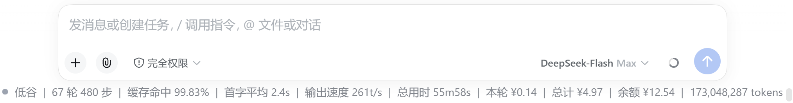
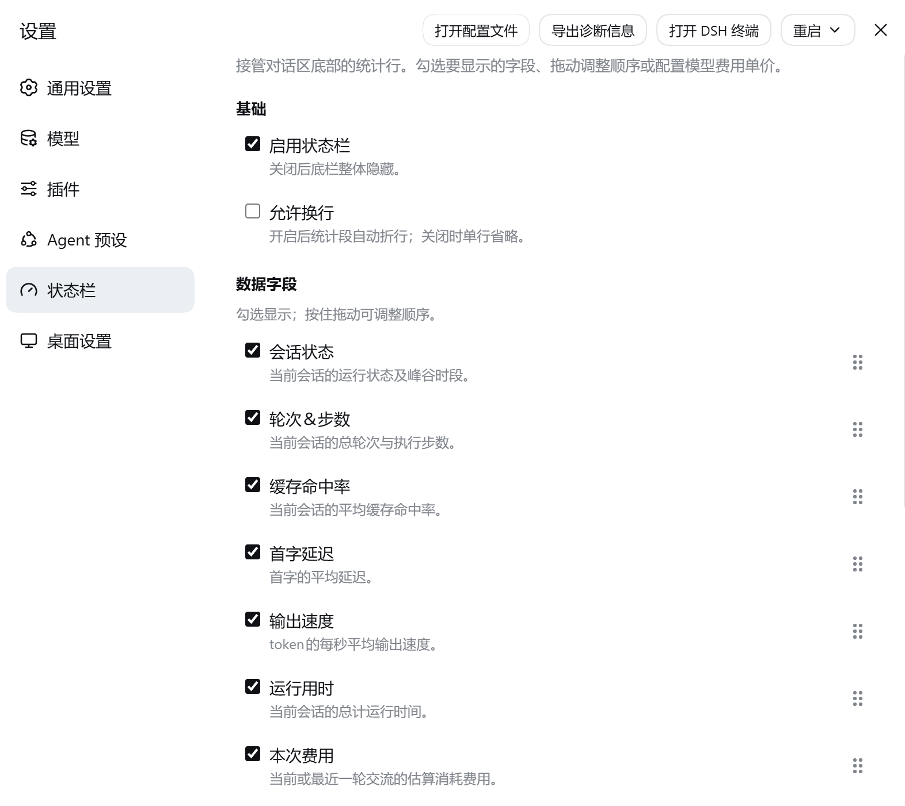
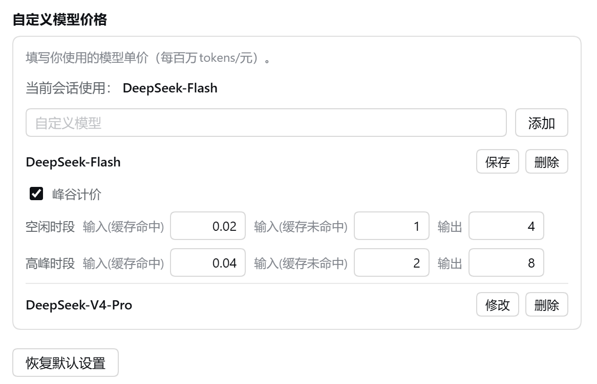

# dsh-desktop-statusbar

把 DSH 桌面端对话区底部的统计行换成一条可配置的状态栏：字段自己挑、顺序自己排、模型单价自己填，费用按官方峰谷口径实时估算。

> 非商业许可（[PolyForm Noncommercial 1.0.0](LICENSE)）：个人使用、学习、教学、非营利组织都可以自由使用和修改，**禁止商业用途**。



## 功能

- **10 个可选字段**：会话状态（运行状态 + 峰谷时段）、轮次与步数、缓存命中率、首字延迟、输出速度、运行用时、本次费用、会话费用、余额、Token 计数
- **自定义顺序**：设置页里拖动把手调整顺序，取消勾选只隐藏、不改变位置；点「恢复默认设置」一键回到出厂顺序并全选
- **费用估算**：按 DeepSeek 官方的峰谷口径计价，每条调用按**自己发生的那一刻**和**自己使用的模型**分别计算后累加，跨时段、跨模型都不会串价
- **模型价格库**：可自定义每个模型的单价；支持「峰谷计价」开关（不勾选就是全天同价）；补填单价后，之前没算上的历史调用会自动补算
- **账户余额**：直连 DeepSeek 余额接口，每分钟刷新（key 只在本机内存中使用，不落盘、不转发）
- **中英双语**：跟随 DSH 的语言设置

## 安装

### 方式一：插件市场 / npm

已发布到 [npm](https://www.npmjs.com/package/dsh-desktop-statusbar)，并收录进 [DSH 1024Store](https://deepseek1024.com/plugins/Rapheal-Y7/dsh-desktop-statusbar)（分类：UI 增强）：

```powershell
dsh plugin --profile desktop add dsh-desktop-statusbar
```

把 `desktop` 换成你自己的 profile 名。不想走 npm 也可以直接装 GitHub 源（内容与 npm 版一致）：

```powershell
dsh plugin --profile desktop add github:Rapheal-Y7/dsh-desktop-statusbar
```

### 方式二：手动安装

1. 把本项目放进 DSH 的本地插件目录：

   ```powershell
   git clone https://github.com/Rapheal-Y7/dsh-desktop-statusbar "$env:USERPROFILE\.dsh\local-plugins\dsh-desktop-statusbar"
   ```

2. 安装依赖（只有一个，`zod`）：

   ```powershell
   cd "$env:USERPROFILE\.dsh\local-plugins\dsh-desktop-statusbar"
   npm install --omit=dev
   ```

3. 用 DSH 自己的命令行装进 profile（它会自动补上依赖声明与链接）：

   ```powershell
   dsh plugin --profile desktop add "$env:USERPROFILE\.dsh\local-plugins\dsh-desktop-statusbar"
   ```

4. 重启 DSH，刷新页面。

## 使用

打开 **设置 → 状态栏**：



- **基础**：启用状态栏、允许换行
- **数据字段**：勾选要显示的字段，按住右侧六点拖动排序
- **自定义模型价格**：填写你使用的模型单价（每百万 tokens / 元）。点「修改」展开编辑，改完点「保存」才写入；新增的模型默认全天同价，需要区分峰谷时勾上「峰谷计价」

### 计费口径

高峰时段为**北京时间周一至周五 9:00-12:00、14:00-18:00**，其余为空闲时段，空闲价为高峰价的一半 —— 与 DeepSeek 官方文档一致（[模型 & 价格](https://api-docs.deepseek.com/zh-cn/quick_start/pricing)，2026-09-15 核对）。

节假日与调休**不单独处理**：官方规则只按星期几判断，所以法定假日落在工作日仍按峰谷算，调休上班的周末仍按空闲价。



### 需要注意

价格库里**没有单价的模型会被跳过不计费**（不是算错，是不知道单价）。补上单价后，该模型此前所有调用会自动补算进总计。底栏的字段会即时更新，不用重开会话。

## 已知限制

- 「当前会话使用」显示的模型名由底栏上报给插件后端再由设置页读取 —— DSH 的设置页是全局槽，拿不到会话投影，所以这一步绕不开
- 隐藏官方状态栏依赖 DSH 的 slot 契约（`conversation.composer.dock`），不依赖官方组件的类名，因此 DSH 更新构建产物不会失效；但如果 DSH 改动 slot 本身，需要跟着改
- 会话投影只保留最近 4000 条调用记录，超出后最旧的记录不再参与费用重算

## 开发

```
tests/    16 个测试脚本（纯 Node，不需要浏览器）
tools/    test.cjs 跑全部测试、sync-from-plugin.cjs 把插件目录的源码同步进项目
```

```powershell
node tools/test.cjs
```

测试覆盖：字段占位与格式化、峰谷边界与跨周末/工作日、价格自愈与补算、存储键迁移、指标悬停、host 路由、导航图标替换、死代码扫描。

## 许可

本项目采用 [PolyForm Noncommercial 1.0.0](LICENSE)：**允许**个人使用、研究、学习、教学、业余项目，以及慈善、教育、公共研究、公共安全/健康、环保、政府机构使用；**允许**修改与再分发（需保留许可与署名）；**禁止**任何商业用途。

这不是 OSI 认可的开源许可证 —— 源码公开，但商业使用需要另行获得授权。

## 致谢

思路来自 DSH 社区的 [`@bananiceee/dsh-status-bar`](https://www.npmjs.com/package/@bananiceee/dsh-status-bar)（MIT 许可）：隐藏官方统计行、用自建底栏接管。

本项目为**独立实现**。与该项目的 0.1.10 版逐行比对结果：非空行 1415 行中有 247 行文字相同（17.5%），其中 190 行是 `}`、`);` 这类短行；**长于 40 字符的相同行仅 9 行**，全部是 DSH 平台集成的必要写法（`ctx.slots.inject(...)`、`useProjection("tokenUsage")`、模块包装样板等）与通用函数命名（`apply`、`formatTokens`、`segmentView` 等）。除这些之外没有相同代码片段。
